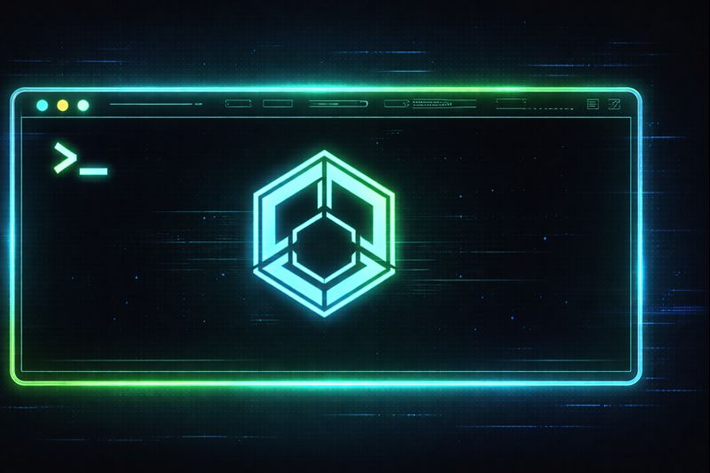

# XTerminal Documentation

<p align="center">
  
</p>

XTerminal is a string-based CLI execution framework for Unity with Linux-like behavior. It allows you to execute commands with support for pipelines, redirects, and extensible custom commands.

## Table of Contents

- [Installation](#installation)
- [Quick Start](#quick-start)
- [Built-in Commands](#built-in-commands)
- [Creating Custom Commands](#creating-custom-commands)
- [UniTask Support](#unitask-support)
- [FlyweightScrollView](#flyweightscrollview)
- [API Reference](#api-reference)

## Installation

### Via Package Manager

1. Open Window > Package Manager
2. Click the "+" button > "Add package from git URL..."
3. Enter the following URL:

```
https://github.com/AraiYuhki/XTerminal.git?path=Packages/jp.xeon.uni-terminal
```

### Via manifest.json

Add the following to your `Packages/manifest.json`:

```json
{
  "dependencies": {
    "jp.xeon.uni-terminal": "https://github.com/AraiYuhki/XTerminal.git?path=Packages/jp.xeon.uni-terminal"
  }
}
```

## Quick Start

### Initialize Terminal

```csharp
using Xeon.XTerminal;

var terminal = new Terminal(
    workingDirectory: Application.dataPath,
    homeDirectory: Application.dataPath,
    registerBuiltInCommands: true
);
```

### Execute Commands

```csharp
using System.IO;

var stdout = new StringWriter();
var stderr = new StringWriter();

// Execute a command
var exitCode = await terminal.ExecuteAsync("echo Hello, World!", stdout, stderr, ct);

// Get output
Debug.Log(stdout.ToString());  // "Hello, World!"
```

### Use Pipelines

```csharp
// Chain commands with pipes
await terminal.ExecuteAsync("cat myfile.txt | grep --pattern=error | less", stdout, stderr, ct);
```

### Use Redirects

```csharp
// Output to file
await terminal.ExecuteAsync("echo Hello > output.txt", stdout, stderr, ct);

// Append to file
await terminal.ExecuteAsync("echo World >> output.txt", stdout, stderr, ct);

// Input from file
await terminal.ExecuteAsync("grep --pattern=pattern < input.txt", stdout, stderr, ct);
```

## Built-in Commands

### File Operations

| Command | Description | Options |
|---------|-------------|---------|
| `pwd` | Print working directory | `-L`, `-P` |
| `cd` | Change directory | `-L`, `-P` |
| `ls` | List directory contents | `-a`, `-l`, `-h`, `-r`, `-R`, `-S` |
| `cat` | Display file contents | - |
| `find` | Search for files | `-n`, `-i`, `-t`, `-d` |
| `less` | View files page by page | `-n`, `-f`, `-N`, `-S` |
| `diff` | Compare files | `-u`, `-i`, `-b`, `-w`, `-q` |

### Text Processing

| Command | Description | Options |
|---------|-------------|---------|
| `echo` | Output text | `-n` |
| `grep` | Pattern matching search | `--pattern`, `-i`, `-v`, `-c` |

### Utilities

| Command | Description | Options |
|---------|-------------|---------|
| `help` | Display help | - |
| `history` | Command history | `-c`, `-d`, `-n`, `-r` |
| `pbcopy` | Copy to clipboard | - |

### Unity-Specific Commands

| Command | Description | Options |
|---------|-------------|---------|
| `hierarchy` | Display scene hierarchy | `-r`, `-d`, `-a`, `-l`, `-s`, `-n`, `-c`, `-t`, `-y` |
| `go` | GameObject operations | `--primitive`, `-P`, `-t`, `-n`, `-c`, `-i`, `-s` |
| `transform` | Transform manipulation | `set`, `add`, `sub` subcommands; `-p`, `-P`, `-r`, `-R`, `-s`, `--parent`, `-w` |
| `component` | Component management | `-a`, `-v`, `-i`, `-n` |
| `property` | Property operations | `list`, `get`, `set`, `add`, `sub`, `mul`, `div` subcommands; `-a`, `-s`, `-n` |

### Command Examples

#### hierarchy - Scene Hierarchy

```bash
# Show root objects
hierarchy

# Recursive display
hierarchy -r

# With details
hierarchy -l

# Filter by name (wildcards supported)
hierarchy -n "Player*"

# Filter by component
hierarchy -c Rigidbody

# Filter by tag
hierarchy -t Player
```

#### go - GameObject Operations

```bash
# Create new GameObject
go create MyObject

# Create primitive
go create Cube --primitive=Cube

# Delete
go delete /MyObject

# Find by name, tag, or component
go find -n "Enemy*"
go find -t Player
go find -c Rigidbody

# Clone
go clone /Original -n Clone --count 5

# Toggle active state
go active /MyObject --toggle
```

#### transform - Transform Operations

```bash
# Display transform info
transform /MyObject

# Set position (world) - both syntaxes work for backward compatibility
transform /MyObject -p 1,2,3
transform set /MyObject -p 1,2,3

# Set position (local)
transform /MyObject -P 0,1,0

# Set rotation
transform /MyObject -r 0,90,0

# Set scale
transform /MyObject -s 2,2,2

# Set parent
transform /Child --parent /Parent

# Add to position (increment)
transform add /MyObject -p 1,0,0      # Move +1 on X axis
transform add /MyObject -r 0,45,0     # Rotate +45 degrees on Y axis
transform add /MyObject -s 0.5        # Increase scale by 0.5

# Subtract from position (decrement)
transform sub /MyObject -p 0,1,0      # Move -1 on Y axis
transform sub /MyObject -r 0,90,0     # Rotate -90 degrees on Y axis
```

#### component - Component Management

```bash
# List components
component list /MyObject

# Add component
component add /MyObject Rigidbody

# Remove component
component remove /MyObject Rigidbody

# Enable/disable
component enable /MyObject BoxCollider
component disable /MyObject BoxCollider
```

#### property - Property Operations

```bash
# List properties
property list /MyObject Rigidbody

# Get property value
property get /MyObject Rigidbody mass

# Set property value
property set /MyObject Rigidbody mass 10
property set /MyObject Transform position 1,2,3

# Arithmetic operations (add, sub, mul, div)
property add /MyObject Rigidbody mass 5       # Add 5 to mass
property sub /MyObject Rigidbody drag 0.1     # Subtract 0.1 from drag
property mul /MyObject Rigidbody mass 2       # Multiply mass by 2
property div /MyObject Rigidbody mass 2       # Divide mass by 2

# Supported types for arithmetic:
# - Numeric: int, float, double, long, byte, short (add, sub, mul, div)
# - Vector: Vector2, Vector3, Vector4, Vector2Int, Vector3Int (add, sub only)

# Vector arithmetic examples
property add /MyObject Transform localScale 1,1,1    # Increase scale
property sub /MyObject Transform position 0,1,0      # Move down by 1
```

## Creating Custom Commands

### Basic Command

```csharp
using Xeon.XTerminal;
using System.Threading;
using System.Threading.Tasks;

[Command("mycommand", "My custom command")]
public class MyCommand : ICommand
{
    [Option("message", "m", Description = "Message to display")]
    public string Message;

    [Option("count", "c", Description = "Repeat count")]
    public int Count = 1;

    public string CommandName => "mycommand";
    public string Description => "My custom command";

    public async Task<ExitCode> ExecuteAsync(CommandContext context, CancellationToken ct)
    {
        for (int i = 0; i < Count; i++)
        {
            await context.Stdout.WriteLineAsync(Message ?? "Hello!", ct);
        }
        return ExitCode.Success;
    }

    public IEnumerable<string> GetCompletions(CompletionContext context)
    {
        yield break;
    }
}
```

### Register Commands

```csharp
// Manual registration
terminal.Registry.Register<MyCommand>();

// Auto-register from assembly
terminal.Registry.RegisterFromAssembly(typeof(MyCommand).Assembly);
```

## UniTask Support

UniTask support is automatically enabled when UniTask is installed in your project.

### Using UniTask Commands

```csharp
using Cysharp.Threading.Tasks;
using Xeon.XTerminal;

// Execute with UniTask
var exitCode = await terminal.ExecuteUniTaskAsync("echo Hello!", stdout, stderr);
```

### Creating UniTask Commands

```csharp
[Command("myasync", "UniTask-based async command")]
public class MyUniTaskCommand : IUniTaskCommand
{
    public string CommandName => "myasync";
    public string Description => "UniTask-based async command";

    public async UniTask<ExitCode> ExecuteAsync(UniTaskCommandContext context, CancellationToken ct)
    {
        await context.Stdout.WriteLineAsync("Processing...", ct);
        await UniTask.Delay(1000, cancellationToken: ct);
        await context.Stdout.WriteLineAsync("Done!", ct);
        return ExitCode.Success;
    }

    public IEnumerable<string> GetCompletions(CompletionContext context)
    {
        yield break;
    }
}
```

## FlyweightScrollView

A virtual scrolling component for efficient display of large amounts of data.

### Features

- Efficient display of large data (handles tens of thousands of lines)
- Vertical and horizontal scroll support
- CircularBuffer for fixed-size log buffering
- ObservableCollection integration

### Usage

```csharp
using Xeon.Common.FlyweightScrollView;
using Xeon.Common.FlyweightScrollView.Model;

// Create buffer (max 1000 lines)
var logBuffer = new CircularBuffer<string>(1000);

// Bind to scroll view
scrollView.Initialize<string, LogItemView>(logItemPrefab, logBuffer);

// Add logs (old entries auto-removed when full)
logBuffer.Add("New log entry");
```

## API Reference

### Terminal Class

| Method | Description |
|--------|-------------|
| `ExecuteAsync(command, stdout, stderr, ct)` | Execute a command asynchronously |
| `ExecuteUniTaskAsync(command, stdout, stderr)` | Execute using UniTask (requires UniTask) |

### Exit Codes

| Code | Constant | Description |
|------|----------|-------------|
| 0 | `ExitCode.Success` | Command succeeded |
| 1 | `ExitCode.UsageError` | Usage error |
| 2 | `ExitCode.RuntimeError` | Runtime error |

### Attributes

| Attribute | Description |
|-----------|-------------|
| `[Command(name, description)]` | Mark class as a command |
| `[Option(name, shortName)]` | Mark field as command option |

## Requirements

- Unity 6000.0 or later
- (Optional) UniTask 2.0 or later

## License

MIT License - see [LICENSE.md](../LICENSE.md) for details.
